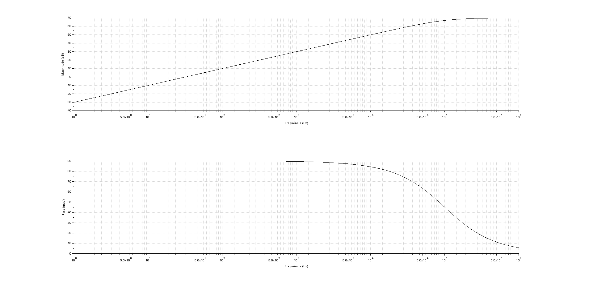
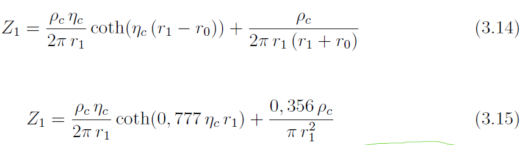
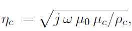
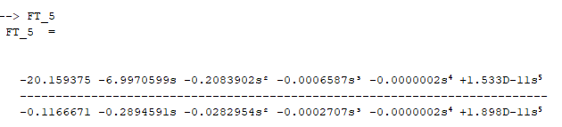

# Descrição dos Scripts desta pasta


>## Teste_FT

Este scrip mostra como fazer as seguintes coisas:
* Criar uma função de trasnferência
* Obter o diagrama de Bode da FT
* Obter a resposta temporal da FT a uma entrada *u*
* Obtar a resposta temporal da FT ao degrau 

Para as respostas no tempo, considerei a seguinte lógica:


> ## Teste_FT_Improprias

Este script mostra como trabalhar com funções de transferência impróprias. Lembrando que, uma FT é imprópria quando a ordem do polinômio do númerador é menor que a ordem do denominador.  

Fiz um teste para representar uma indutância. Neste caso, a função te trasferência é Z = L s, ou seja, imprópria. Para corrigir isso, inseri um polo em uma frequência fc muito alta. O diagrama de Bode mostra que Z tem o comportamento de uma indutância (reta com incrinação de 20dB/dec para o diagrama de magnitude e constante igual a 90º para o diagrama de fase) até mais ou menos 1kHz. 

```c
// Parcela para tornar própria uma FT imprópria
fc = 1e5
wc = 2* %pi * fc 
Gp =  wc/(s +wc) // Introduz um polo na frequência fc


// Indutância
L = 5e-3 
Z = L*s * Gp // Introduz um polo na frequência fc

```




> ## Teste_data_2_TF

Este é um script usado para obter a função de transferência no dominío de laplace a partir de valores numéricos. Esta ideia é útil para obter models no domínio s para elemntos com equações como estas:





Neste caso, não dá para diretamente montar uma equação de Laplace para algo que tenha raiz quadrada da frequência. Contudo, podemos calcular Z1 para diferentes valores de $\omega$ e usar estes dados para obter uma função de trasnferência de Laplace aproximada.

No script, fiz algo como isso com alguns valores aleatórios

```c
// definido da pg 26, depois da eq (3.13) da Tese do Paulo
eta_c = sqrt(j*w*mu_0*mu_c/ro_c)

// cotangente da eq 3.14
// Esta é uma resposta em frequência numérica
Z1_ctg = coth(eta_c*(r1-r0))

// Obtenção de uma função de transferência aproximada
FT_5 = frep2tf(f,Z1_ctg,5) // FT com grau 5
```

Com os valores aleatórios que usei, obtive o seguinte resultado:



