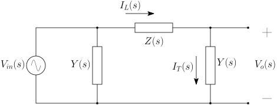

# Simulação de circuitos matriciais usando SciLab

[toc]

<!-- 
-------------------------------------------------
-------------------------------------------------
-------------------------------------------------
-------------------------------------------------
-------------------------------------------------
-->
## Definição Geral

De uma forma geral, o cabo modelado pode ser representado pela seguinte figura. Observe que o sistema está em circuito aberto, como na figura 4.1 da referência [1]. Neste caso, $V_{in}$ é a tensão aplicada na entrada e $V_o$ a tensão colhida na saída.

O circuito apresenta uma representação matricial, assim , as variáveis devem ser presentadas por vetores $6 \times 1$:

$$
\mathbf{V}_{in} =
\begin{bmatrix}
V_{in,An}\\ 
V_{in,Ab}\\
V_{in,Bn}\\ 
V_{in,Bb}\\ 
V_{in,Cn}\\ 
V_{in,Cb}    
\end{bmatrix}
\quad \quad \quad \quad 
\mathbf{I}_{L} =
\begin{bmatrix}
I_{L,An}\\ 
I_{L,Ab}\\
I_{L,Bn}\\ 
I_{L,Bb}\\ 
I_{L,Cn}\\ 
I_{L,Cb}    
\end{bmatrix}
\quad \quad \quad \quad 
\mathbf{I}_{T} =
\begin{bmatrix}
I_{T,An}\\ 
I_{T,Ab}\\
I_{T,Bn}\\ 
I_{T,Bb}\\ 
I_{T,Cn}\\ 
I_{T,Cb}    
\end{bmatrix}
\quad \quad \quad \quad 
\mathbf{V}_{o} =
\begin{bmatrix}
V_{o,An}\\ 
V_{o,Ab}\\
V_{o,Bn}\\ 
V_{o,Bb}\\ 
V_{o,Cn}\\ 
V_{o,Cb}    
\end{bmatrix}
$$

As seis linhas de cada vetor podem ser divididas em três pares, um par para cada fase. Sendo assim, $I_{L,An}$ e $I_{L,Ab}$ são, respectivamente, as correntes do núcleo e da blindágem da fase <code>A</code>. A lógica é a mesma para as demais componentes dos vetores apresentados. Observe a notação: letras em negrito representam matrizes ou vetores e letras normais representam variáveis escalares.  

<!-- 
-------------------------------------------------
-------------------------------------------------
-------------------------------------------------
-------------------------------------------------
-------------------------------------------------
-->
## Matriz de Impedância Série

De acordo com a seção 3.2 de [1, pg 25], a impedância série pode ser representada da seguinte maneira:

$$
\mathbf{Z}(s) = \mathbf{Z}_i(s) + \mathbf{Z}_{ext}(s) 
$$

onde 

$$
\mathbf{Z}_i(s) = 
\begin{bmatrix}
\mathbf{Z}_{cabo~in_1} & \mathbf{0}_{2\times 2} & \mathbf{0}_{2\times 2}\\
\mathbf{0}_{2\times 2} & \mathbf{Z}_{cabo~in_2} & \mathbf{0}_{2\times 2}\\
\mathbf{0}_{2\times 2} & \mathbf{0}_{2\times 2} & \mathbf{Z}_{cabo~in_3}\\    
\end{bmatrix} 
$$

$$
\mathbf{Z}_{ext}(s) = 
\begin{bmatrix}
\mathbf{Z}_{cabo~out_1} & \mathbf{Z}_{12} & \mathbf{Z}_{13}\\
\mathbf{Z}_{21} & \mathbf{Z}_{cabo~out_2} & \mathbf{Z}_{23}\\
\mathbf{Z}_{31} & \mathbf{Z}_{32} & \mathbf{Z}_{cabo~out_3}\\    
\end{bmatrix} 
$$

Através da definição apresentada em [1, pg 25], podemos escrever:

$$
\mathbf{Z}_{cabo~in_n}(s) = 
\begin{bmatrix}
{Z}_{cc} & {Z}_{cs}\\
{Z}_{sc} & {Z}_{ss}
\end{bmatrix} 
$$

Para a impedância externa, cada uma das submatrizes será dada por [1, pg 102]:

$$
\mathbf{Z}_{ij}(s) = 
\begin{bmatrix}
{Z}_{ij} & {Z}_{ij}\\
{Z}_{ij} & {Z}_{ij}
\end{bmatrix} 
$$

Observe que $\mathbf{Z}_{11} = \mathbf{Z}_{cabo~out_1}$, $\mathbf{Z}_{22} = \mathbf{Z}_{cabo~out_2}$ e $\mathbf{Z}_{33} = \mathbf{Z}_{cabo~out_3}$. Então, as matrizes podem ser escritas de forma expandida da seguinte forma:

$$
\mathbf{Z}_i(s) = 
\left[
\begin{array}{c:c:c}
    \begin{array}{cc}
        Z_{cc,1} & Z_{cs,1}\\
        Z_{sc,1} & Z_{ss,1}
    \end{array} &
       \begin{array}{cc}
        0 & 0\\
        0 & 0
    \end{array} &
    \begin{array}{cc}
        0 & 0\\
        0 & 0
    \end{array} \\ \hdashline
    \begin{array}{cc}
        0 & 0\\
        0 & 0
    \end{array} &
    \begin{array}{cc}
        Z_{cc,2} & Z_{cs,2}\\
        Z_{sc,2} & Z_{ss,2}
    \end{array} &
    \begin{array}{cc}
        0 & 0\\
        0 & 0
    \end{array} \\ \hdashline
    \begin{array}{cc}
        0 & 0\\
        0 & 0
    \end{array} &
    \begin{array}{cc}
        0 & 0\\
        0 & 0
    \end{array} &
    \begin{array}{cc}
        Z_{cc,3} & Z_{cs,3}\\
        Z_{sc,3} & Z_{ss,3}
    \end{array}
\end{array}
\right]
$$

$$
\mathbf{Z}_{ext}(s) = 
\left[
\begin{array}{c:c:c}
    \begin{array}{cc}
        Z_{11} & Z_{11}\\
        Z_{11} & Z_{11}
    \end{array} &
       \begin{array}{cc}
        Z_{12} & Z_{12}\\
        Z_{12} & Z_{12}
    \end{array} &
    \begin{array}{cc}
        Z_{13} & Z_{13}\\
        Z_{13} & Z_{13}
    \end{array} \\ \hdashline
    \begin{array}{cc}
        Z_{21} & Z_{21}\\
        Z_{21} & Z_{21}
    \end{array} &
    \begin{array}{cc}
        Z_{22} & Z_{22}\\
        Z_{22} & Z_{22}
    \end{array} &
    \begin{array}{cc}
        Z_{23} & Z_{23}\\
        Z_{23} & Z_{23}
    \end{array} \\ \hdashline
    \begin{array}{cc}
        Z_{31} & Z_{31}\\
        Z_{31} & Z_{31}
    \end{array} &
    \begin{array}{cc}
        Z_{32} & Z_{32}\\
        Z_{32} & Z_{32}
    \end{array} &
    \begin{array}{cc}
        Z_{33} & Z_{33}\\
        Z_{33} & Z_{33}
    \end{array}
\end{array}
\right]
$$

<!-- 
-------------------------------------------------
-------------------------------------------------
-------------------------------------------------
-------------------------------------------------
-------------------------------------------------
-->
## Primeira abordagem: utilizando apenas o SciLab 

<!-- 
-------------------------------------------------
-------------------------------------------------
-------------------------------------------------
-------------------------------------------------
-------------------------------------------------
-->
## Primeira abordagem: utilizando apenas o SciLab 

<!-- 
-------------------------------------------------
-------------------------------------------------
-------------------------------------------------
-------------------------------------------------
-------------------------------------------------
-->
## Segunda abordagem: utilizando o XCOS

<!-- 
-------------------------------------------------
-------------------------------------------------
-------------------------------------------------
-------------------------------------------------
-------------------------------------------------
-->
## Referências

[1] Darski Rocha, P. E. **Modelagem de Cabos Subterrâneos e Sub-marinos para Estudos de Transitórios**. Dissertação (Mestrado em Engenharia Elétrica) – Universidade Federal do Rio de Janeiro, COPPE. Rio de Janeiro, p. 115. 2007.
