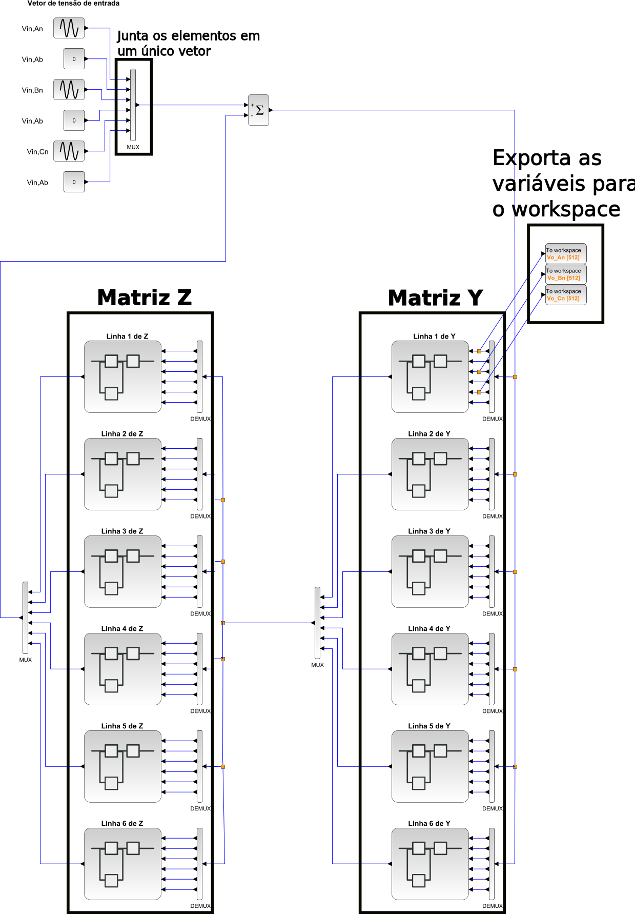
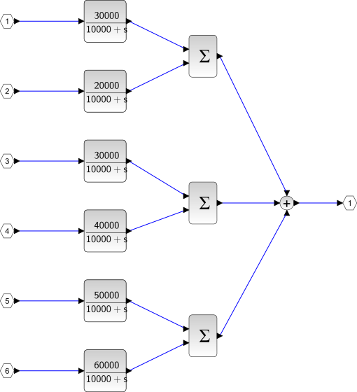
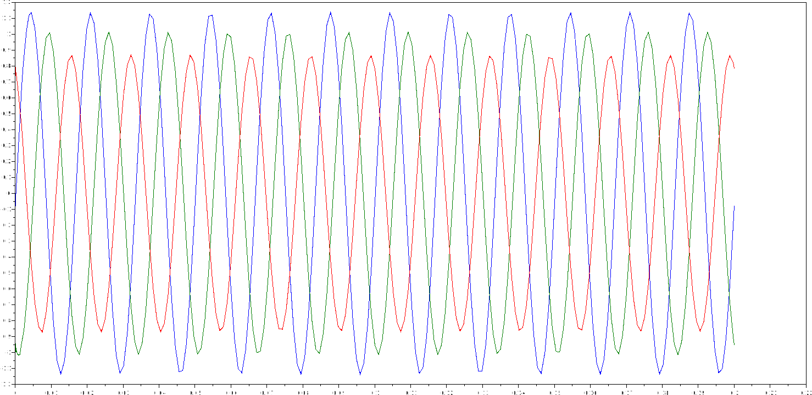

# Simulação de circuitos matriciais usando SciLab


[toc]


<!-- 
-------------------------------------------------
-------------------------------------------------
-------------------------------------------------
-------------------------------------------------
-------------------------------------------------
-->
## Definição Geral

De uma forma geral, o cabo modelado pode ser representado pela seguinte figura. Observe que o sistema está em circuito aberto, como na figura 4.1 da referência [1]. Neste caso, $V_{in}$ é a tensão aplicada na entrada e $V_o$ a tensão colhida na saída.


<p align="center">

</p>


O circuito apresenta uma representação matricial, assim , as variáveis devem ser presentadas por vetores $6 \times 1$:

$$
\mathbf{V}_{in} =
\begin{bmatrix}
V_{in,An}\\ 
V_{in,Ab}\\
V_{in,Bn}\\ 
V_{in,Bb}\\ 
V_{in,Cn}\\ 
V_{in,Cb}    
\end{bmatrix}
\quad \quad \quad \quad 
\mathbf{I}_{L} =
\begin{bmatrix}
I_{L,An}\\ 
I_{L,Ab}\\
I_{L,Bn}\\ 
I_{L,Bb}\\ 
I_{L,Cn}\\ 
I_{L,Cb}    
\end{bmatrix}
\quad \quad \quad \quad 
\mathbf{I}_{T} =
\begin{bmatrix}
I_{T,An}\\ 
I_{T,Ab}\\
I_{T,Bn}\\ 
I_{T,Bb}\\ 
I_{T,Cn}\\ 
I_{T,Cb}    
\end{bmatrix}
\quad \quad \quad \quad 
\mathbf{V}_{o} =
\begin{bmatrix}
V_{o,An}\\ 
V_{o,Ab}\\
V_{o,Bn}\\ 
V_{o,Bb}\\ 
V_{o,Cn}\\ 
V_{o,Cb}    
\end{bmatrix}
$$

As seis linhas de cada vetor podem ser divididas em três pares, um par para cada fase. Sendo assim, $I_{L,An}$ e $I_{L,Ab}$ são, respectivamente, as correntes do núcleo e da blindágem da fase <code>A</code>. A lógica é a mesma para as demais componentes dos vetores apresentados. Observe a notação: letras em negrito representam matrizes ou vetores e letras normais representam variáveis escalares.  


<!-- 
-------------------------------------------------
-------------------------------------------------
-------------------------------------------------
-------------------------------------------------
-------------------------------------------------
-->
## Matriz de Impedância Série

De acordo com a seção 3.2 de [1, pg 25], a impedância série pode ser representada da seguinte maneira:

$$
\mathbf{Z}(s) = \mathbf{Z}_i(s) + \mathbf{Z}_{ext}(s) 
$$

onde 

$$
\mathbf{Z}_i(s) = 
\begin{bmatrix}
\mathbf{Z}_{cabo~in_1} & \mathbf{0}_{2\times 2} & \mathbf{0}_{2\times 2}\\
\mathbf{0}_{2\times 2} & \mathbf{Z}_{cabo~in_2} & \mathbf{0}_{2\times 2}\\
\mathbf{0}_{2\times 2} & \mathbf{0}_{2\times 2} & \mathbf{Z}_{cabo~in_3}\\    
\end{bmatrix} 
$$

$$
\mathbf{Z}_{ext}(s) = 
\begin{bmatrix}
\mathbf{Z}_{cabo~out_1} & \mathbf{Z}_{12} & \mathbf{Z}_{13}\\
\mathbf{Z}_{21} & \mathbf{Z}_{cabo~out_2} & \mathbf{Z}_{23}\\
\mathbf{Z}_{31} & \mathbf{Z}_{32} & \mathbf{Z}_{cabo~out_3}\\    
\end{bmatrix} 
$$


Através da definição apresentada em [1, pg 25], podemos escrever:

$$
\mathbf{Z}_{cabo~in_n}(s) = 
\begin{bmatrix}
{Z}_{cc} & {Z}_{cs}\\
{Z}_{sc} & {Z}_{ss}
\end{bmatrix} 
$$


Para a impedância externa, cada uma das submatrizes será dada por [1, pg 102]:

$$
\mathbf{Z}_{ij}(s) = 
\begin{bmatrix}
{Z}_{ij} & {Z}_{ij}\\
{Z}_{ij} & {Z}_{ij}
\end{bmatrix} 
$$

Observe que $\mathbf{Z}_{11} = \mathbf{Z}_{cabo~out_1}$, $\mathbf{Z}_{22} = \mathbf{Z}_{cabo~out_2}$ e $\mathbf{Z}_{33} = \mathbf{Z}_{cabo~out_3}$. Então, as matrizes podem ser escritas de forma expandida da seguinte forma:

$$
\mathbf{Z}_i(s) = 
\left[
\begin{array}{c:c:c}
    \begin{array}{cc}
        Z_{cc,1} & Z_{cs,1}\\
        Z_{sc,1} & Z_{ss,1}
    \end{array} &
       \begin{array}{cc}
        0 & 0\\
        0 & 0
    \end{array} &
    \begin{array}{cc}
        0 & 0\\
        0 & 0
    \end{array} \\ \hdashline
    \begin{array}{cc}
        0 & 0\\
        0 & 0
    \end{array} &
    \begin{array}{cc}
        Z_{cc,2} & Z_{cs,2}\\
        Z_{sc,2} & Z_{ss,2}
    \end{array} &
    \begin{array}{cc}
        0 & 0\\
        0 & 0
    \end{array} \\ \hdashline
    \begin{array}{cc}
        0 & 0\\
        0 & 0
    \end{array} &
    \begin{array}{cc}
        0 & 0\\
        0 & 0
    \end{array} &
    \begin{array}{cc}
        Z_{cc,3} & Z_{cs,3}\\
        Z_{sc,3} & Z_{ss,3}
    \end{array}
\end{array}
\right]
$$


$$
\mathbf{Z}_{ext}(s) = 
\left[
\begin{array}{c:c:c}
    \begin{array}{cc}
        Z_{11} & Z_{11}\\
        Z_{11} & Z_{11}
    \end{array} &
       \begin{array}{cc}
        Z_{12} & Z_{12}\\
        Z_{12} & Z_{12}
    \end{array} &
    \begin{array}{cc}
        Z_{13} & Z_{13}\\
        Z_{13} & Z_{13}
    \end{array} \\ \hdashline
    \begin{array}{cc}
        Z_{21} & Z_{21}\\
        Z_{21} & Z_{21}
    \end{array} &
    \begin{array}{cc}
        Z_{22} & Z_{22}\\
        Z_{22} & Z_{22}
    \end{array} &
    \begin{array}{cc}
        Z_{23} & Z_{23}\\
        Z_{23} & Z_{23}
    \end{array} \\ \hdashline
    \begin{array}{cc}
        Z_{31} & Z_{31}\\
        Z_{31} & Z_{31}
    \end{array} &
    \begin{array}{cc}
        Z_{32} & Z_{32}\\
        Z_{32} & Z_{32}
    \end{array} &
    \begin{array}{cc}
        Z_{33} & Z_{33}\\
        Z_{33} & Z_{33}
    \end{array}
\end{array}
\right]
$$


<!-- 
-------------------------------------------------
-------------------------------------------------
-------------------------------------------------
-------------------------------------------------
-------------------------------------------------
-->
## Matrix de Parãmetros Transversais

Na equação (3.62) de [1], é definido a matriz $\mathbf{P}$ de coeficientes dos pot~encias de Maxwell:

$$
\mathbf{P} = \mathbf{P}_i + \mathbf{P}_p + \mathbf{P}_c + \mathbf{P}_0
$$


Como explicado na página 44, a matriz $\mathbf{P}_p$ e $\mathbf{P}_c$ não são necessárias para o nosso caso (só se aplicam para cabos *Pipe-Type*). Além disso, a matriz $\mathbf{P}_0$ também não se aplica ao nosso caso (só é considerada em sitemas aérios).


A idéia é que com a matriz $\mathbf{P}$ é possível definir de forma fácil a admitância $\mathbf{Y}$ mostrada no circuito da figura anterior. Ou seja:

$$
\mathbf{Y} =
j \omega \mathbf{P}^{-1} = s \mathbf{P}^{-1} =
\frac{s}{s+\omega_p} \mathbf{P}^{-1}  
$$

Observe que inclui um polo em alta frequência na definição de $\mathbf{Y}$ para tornar a função de trasnferência própria.


<!-- 
-------------------------------------------------
-------------------------------------------------
-------------------------------------------------
-------------------------------------------------
-------------------------------------------------
-->
## Definições

Daqui por diante vou utilizar a seguintes definições:


$$
\mathbf{Z} =
\begin{bmatrix}
    Z_{11} & Z_{12} & Z_{13} & Z_{14} & Z_{15} & Z_{16}\\
    Z_{21} & Z_{22} & Z_{23} & Z_{24} & Z_{25} & Z_{26}\\
    Z_{31} & Z_{32} & Z_{33} & Z_{34} & Z_{35} & Z_{36}\\
    Z_{41} & Z_{42} & Z_{43} & Z_{44} & Z_{45} & Z_{46}\\
    Z_{51} & Z_{52} & Z_{53} & Z_{54} & Z_{55} & Z_{56}\\
    Z_{61} & Z_{62} & Z_{63} & Z_{64} & Z_{65} & Z_{66}\\
\end{bmatrix}
$$


$$
\mathbf{Y} =
\begin{bmatrix}
    Y_{11} & Y_{12} & Y_{13} & Y_{14} & Y_{15} & Y_{16}\\
    Y_{21} & Y_{22} & Y_{23} & Y_{24} & Y_{25} & Y_{26}\\
    Y_{31} & Y_{32} & Y_{33} & Y_{34} & Y_{35} & Y_{36}\\
    Y_{41} & Y_{42} & Y_{43} & Y_{44} & Y_{45} & Y_{46}\\
    Y_{51} & Y_{52} & Y_{53} & Y_{54} & Y_{55} & Y_{56}\\
    Y_{61} & Y_{62} & Y_{63} & Y_{64} & Y_{65} & Y_{66}\\
\end{bmatrix}
$$


**Muito Importante:** Usei $Z_{11}$, $Z_{12}$, etc para facilita a notação. Ou seja, elês não tem relação com os elementos de mesmo nome encontrados em $\mathbf{Z}_{ext}$.


Para realização do meu teste, vou definir valores genéricos para $Z_{11} \dots Z_{66}$ e $Y_{11} \dots Y_{66}$. A idéia é substituir cada um destes pelas componentes calculadas de cada uma das matrizes.

<!-- 
-------------------------------------------------
-------------------------------------------------
-------------------------------------------------
-------------------------------------------------
-------------------------------------------------
-->
## Processamento preliminar


Para simular o cabo, precisamos equacionar o circuito da figura seguinte:


<p align="center">

</p>


Podemos escrever estas duas equações:

$$
\mathbf{V}_{in} - \mathbf{Z} \mathbf{I}_{L} = \mathbf{V}_o
$$


$$
\mathbf{I}_{T} = \mathbf{Y} \mathbf{V}_{o} 
$$


Neste caso, a LT não está alimentando nenhuma carga. Assim, $\mathbf{I}_{T} = \mathbf{I}_{L}$. Como desevamos obter $\mathbf{V}_{o}$ em função de $\mathbf{V}_{in}$, devemos combinar estas duas equações:


$$
\mathbf{V}_{in} - \mathbf{Z} \mathbf{Y} \mathbf{V}_{o}  = \mathbf{V}_o
$$


<!-- 
-------------------------------------------------
-------------------------------------------------
-------------------------------------------------
-------------------------------------------------
-------------------------------------------------
-->
## Primeira abordagem: utilizando apenas o SciLab 


Neste caso, podemos fazer o seguinte caminho:

$$
\mathbf{V}_{in} - \mathbf{Z} \mathbf{Y} \mathbf{V}_{o}  = \mathbf{V}_o
$$

$$
\mathbf{V}_{in} = \mathbf{V}_o + \mathbf{Z} \mathbf{Y} \mathbf{V}_{o}
$$


$$
\mathbf{V}_{in} = \left(\mathbf{I} + \mathbf{Z} \mathbf{Y} \right) \mathbf{V}_{o}
$$


$$
\mathbf{V}_{o} = 
\left(\mathbf{I} + \mathbf{Z} \mathbf{Y} \right)^{-1}
\mathbf{V}_{in}
$$

onde $\mathbf{I}$ é uma matriz identidade $6 \times 6$.


No nosso caso, $\mathbf{Z}$ e $\mathbf{Y}$ são matrizes de transferência. Para resposa a entrada senoidas, teremos as seguintes componentes para $\mathbf{V}_{in}$ (assumindo que a blindagem está aterrada):

$$
\mathbf{V}_{in} = 
\begin{bmatrix}
V_P \left(\frac{\omega}{s^2 + \omega^2}\right)\\
0\\
V_P \left(\frac{\omega}{s^2 + \omega^2}\right) e^{-\frac{2\pi}{3}s}\\
0\\
V_P \left(\frac{\omega}{s^2 + \omega^2}\right) e^{\frac{2\pi}{3}s}\\
0\\
\end{bmatrix} 
$$

onde $V_P \left(\frac{\omega}{s^2 + \omega^2}\right)$ é a representação no domínio de Laplace de uma senoide de amplitude $V_P$ e frequencia angular $\omega$. Os termos $e^{\pm {2\pi}s/3}$ representam as defasagens das fases B e C.

Para obter a responta no tempo, teriamos que fazer:

$$
\mathbf{V}_{o}(t) = \mathcal{L}^{-1}
\bigg\{
\left(\mathbf{I} + \mathbf{Z} \mathbf{Y} \right)^{-1}
\mathbf{V}_{in}
\bigg\} 
$$


Embora esta pareça uma solução rápida, exitem dois problemas que a tornam mais difícil:
* Inversão de matrizes de trasnferência sempre geram erros numéricos. Às vezes estes erros não causam grandes problemas, mas outras vezes eles invalidam por completo o resultado.
* O Scilab não possui função para fazer transformada inversa de Laplace.


<!-- 
-------------------------------------------------
-------------------------------------------------
-------------------------------------------------
-------------------------------------------------
-------------------------------------------------
-->
## Segunda abordagem: utilizando o XCOS

Considere a equação matrical obtida anteriormente:

$$
\mathbf{V}_{in} - \mathbf{Z} \mathbf{Y} \mathbf{V}_{o}  = \mathbf{V}_o
$$

Ela pode ser implementada, seguindo uma abordagem de diagramas de blocos, da seguinte forma:


<p align="center">

</p>

Infelizmente, deferentemente do SIMULINK, o XCOS não tem suporte a implementação de matrizes de trasnferência. Sendo assim, temos que fazer o diagrama de bloco incluindo cada um dos elementos da matrix. A próxima figura mostra uma possível implementação no XCOS com esta abordagem.


<p align="center">

</p>

Neste circuito, as seis linhas de cada matrix ($\mathbf{Z}$ e $\mathbf{Y}$) são representadas por blocos <code>SUPER_F</code>, que são encontrados dentro do grupo <code>Funções definidas pelo usuário</code> na paleta de componentes do XCOS. Ovserve que o vetor das tensões de entrada $\mathbf{V}_{in}$ é formado através da combinação de seis fontes e um multiplexador (MUX). A saída deste multiplexador é um sinal vetorial com seis componentes. O mesmo acontece com os sinais de entrada e de saída do somador da figura. Alguns multiplexadores (une as componentes de um vetor) e demultiplexadores (separa as componentes de um verot) foram usados no circuito para evitar a embolação de fios. Os blocos que representam as linhas das matrizes possuem estrutura igual a da figura seguinte.


<p align="center">

</p>

Este bloco esta, simplemente, representando as operações matriciais, linhas por linha. Ou seja, o bloco **Linha 1 de Y** reproduz a seguinte equação:

$$
I_{T,An} =
Y_{11} V_{o,An} +
Y_{12} V_{o,Ab} +
Y_{13} V_{o,Bn} + 
Y_{14} V_{o,Bb} +
Y_{15} V_{o,Cn} +
Y_{16} V_{o,Cb}
$$

Sendo que $Y_{11}$ é a função de trasnferência (FT) que deve ser configurada no primeiro bloco de cima para baixo, $Y_{12}$ no segundo, $Y_{13}$ no terceiro e assim por diante.

Teremos a seguinte equação para o bloco **Linha 2 de Y**:

$$
I_{T,Ab} =
Y_{21} V_{o,An} +
Y_{22} V_{o,Ab} +
Y_{23} V_{o,Bn} + 
Y_{24} V_{o,Bb} +
Y_{25} V_{o,Cn} +
Y_{26} V_{o,Cb}
$$

A lógica se reprete para todas as linhas de  $\mathbf{Y}$ e também para todas as linhas de  $\mathbf{Z}$. 


Tive problemas com os <code>scopes</code>, então decidi exportar as variáveis desejadas para o workspace. Isso é feito com o uso dos blocos <code>TOWS_c</code>, encontrados na paleta <code>Receptores</code> do XCOS. É possível definir neles o nome de uma variável e a quatidades de pontos para armazenar. Cada uma das variáveis tem dois campos, um com o tempo e outro com o valor da variável. O pedaço de código a seguir mostra como plotar os gráficos após a simulação do XCOS:


```matlab
t1 = Vo_An.time
vo_An = Vo_An.values

t2 = Vo_Bn.time
vo_Bn = Vo_Bn.values

t3 = Vo_Cn.time
vo_Cn = Vo_Cn.values

plot(t1,vo_An,t2,vo_Bn,t3,vo_Cn)
```

O resultado é mostrado na próxima figura:

<p align="center">

</p>

<!-- 
-------------------------------------------------
-------------------------------------------------
-------------------------------------------------
-------------------------------------------------
-------------------------------------------------
-->
## Referências

[1] Darski Rocha, P. E. **Modelagem de Cabos Subterrâneos e Sub-marinos para Estudos de Transitórios**. Dissertação (Mestrado em Engenharia Elétrica) – Universidade Federal do Rio de Janeiro, COPPE. Rio de Janeiro, p. 115. 2007.
